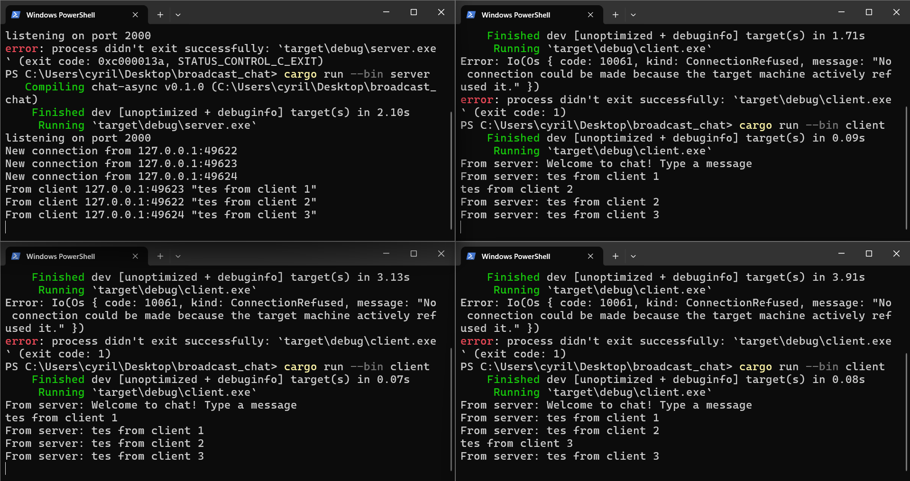

<b>2.1 Original Code</b>

Untuk menjalankan program ini pengguna harus memasukkan command `cargo run --bin server` dan `cargo run --bin client`. Setelah program berjalan pengguna dapat menginput text pada aplikasi client dan selanjutnya server akan mem-broadcast text tersebut ke client lainnya yang terhubung, untuk melihat pesan tersebut dibroadcast ke client lain pengguna dapat me-run beberapa aplikasi client.

<b>2.2 Modifying Port</b>

Ketika kita mengubah port pada aplikasi client maka outputnya akan seperti ini

Untuk memperbaiki error tersebut kita harus mengganti juga port pada aplikasi server menjadi `8080` agar aplikasi dapat berjalan lancar seperti berikut


<b>2.3 Small Changes</b>

Untuk menambahkan informasi mengenai setiap client yang mengirim pesan kita perlu mengubah bagian kode berikut pada `server.rs`
```
if let Some(text) = msg.as_text() {
                            println!("From client {addr:?} {text:?}");
                            bcast_tx.send(format!("{addr} : {text}"))?;
                        }
```